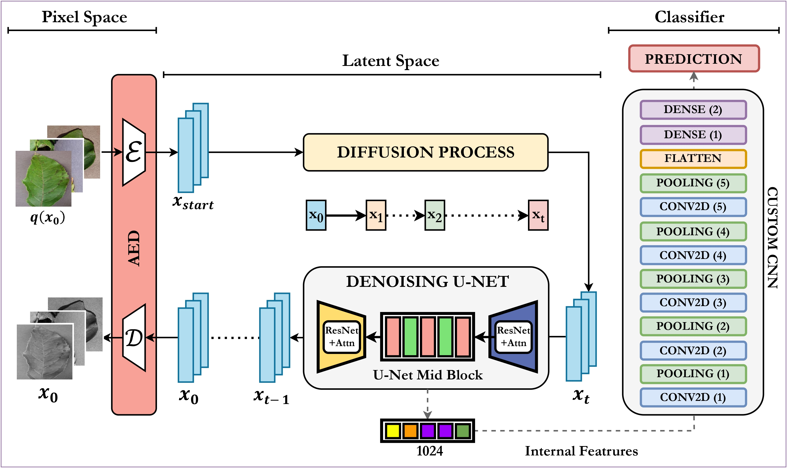

# [A Generative Framework for Detection and Classification of Plant Leaf Disease Using Diffusion Network](https://www.sciencedirect.com/science/article/pii/S1568494625004636?dgcid=author)

[Aryan Das](https://tinyurl.com/aryandas), [Rajul Mahto](), [Wen-Tao Wang](anywherehope.com), [Ali Jamali](http://www.sfu.ca/geography/about/our-people/profiles/ali-jamali.html), [Pravendra Singh](https://www.iitr.ac.in/~CSE/Pravendra_Singh), and [Swalpa Kumar Roy](https://swalpa.github.io)


The repository contains the implementations for A Generative Framework for Detection and Classification of Plant Leaf Disease Using Diffusion Network




---------------------
### Dataset

* **Apple Leaf Diseases** - https://www.kaggle.com/datasets/ludehsar/apple-disease-dataset


* **Bangladeshi Crop Diseases** - https://www.kaggle.com/datasets/nafishamoin/bangladeshi-crops-disease-dataset


* **PlantVillage** - https://www.kaggle.com/datasets/abdallahalidev/plantvillage-dataset


Citation
---------------------

**Please kindly cite the papers if this code is useful and helpful for your research.**
  
  ```
  @article{DAS2025113152,
    title     = {A generative framework for detection and classification of plant leaf disease using diffusion network},
    author    = {Aryan Das and Rajul Mahto and Wentao Wang and Ali Jamali and Pravendra Singh and Swalpa Kumar Roy},
    journal   = {Applied Soft Computing},
    volume    = {177},
    pages     = {113152},
    year      = {2025},
    issn      = {1568-4946},
    doi       = {10.1016/j.asoc.2025.113152},
    url       = {https://www.sciencedirect.com/science/article/pii/S1568494625004636}
  }
  ```
